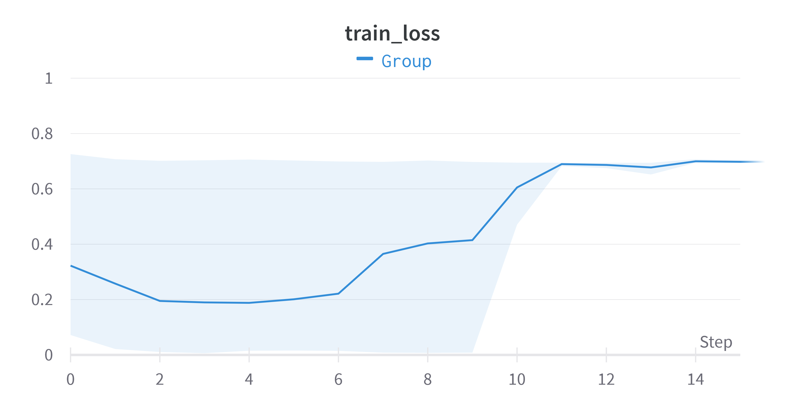
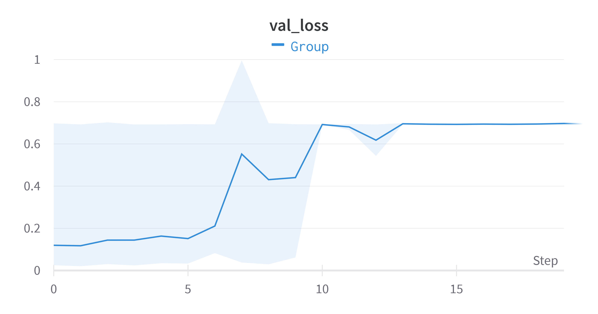
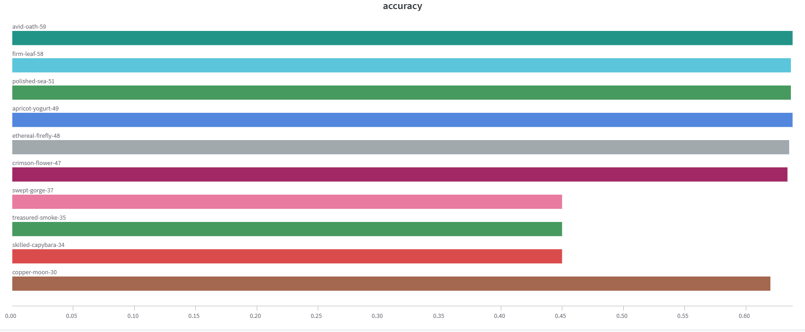
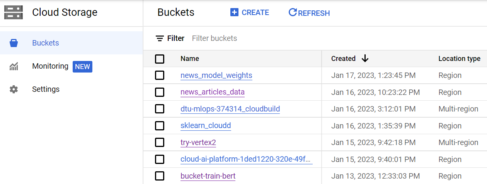
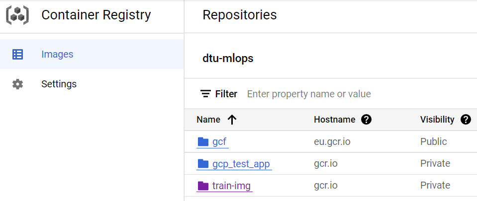
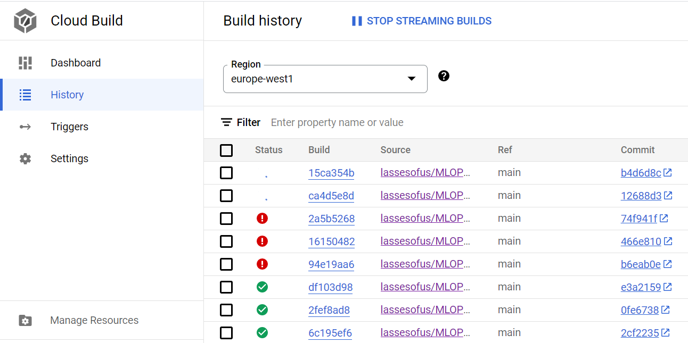
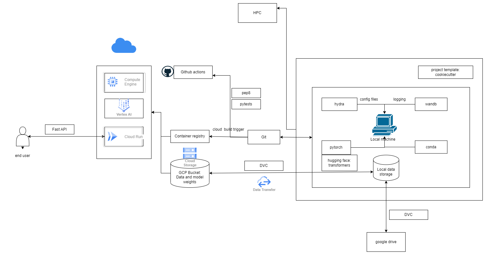

# Exam template for 02476 Machine Learning Operations

This is the report template for the exam. Please only remove the text formatted as with three dashes in front and behind
like:

```--- question 1 fill here ---```

where you instead should add your answers. Any other changes may have unwanted consequences when your report is auto
generated in the end of the course. For questions where you are asked to include images, start by adding the image to
the `figures` subfolder (please only use `.png`, `.jpg` or `.jpeg`) and then add the following code in your answer:

```markdown

```

In addition to this markdown file, we also provide the `report.py` script that provides two utility functions:

Running:

```bash
python report.py html
```

will generate an `.html` page of your report. After deadline for answering this template, we will autoscrape
everything in this `reports` folder and then use this utility to generate an `.html` page that will be your serve
as your final handin.

Running

```bash
python report.py check
```

will check your answers in this template against the constrains listed for each question e.g. is your answer too
short, too long, have you included an image when asked to.

For both functions to work it is important that you do not rename anything. The script have two dependencies that can
be installed with `pip install click markdown`.

## Group information

### Question 1
> **Enter the group number you signed up on <learn.inside.dtu.dk>**
>
> Answer:

35

### Question 2
> **Enter the study number for each member in the group**
>
> Example:
>
> *sXXXXXX, sXXXXXX, sXXXXXX*
>
> Answer:

s185927, s194278, s194252, s221932, s212592

### Question 3
> **What framework did you choose to work with and did it help you complete the project?**
>
> Answer length: 100-200 words.
>
> Example:
> *We used the third-party framework ... in our project. We used functionality ... and functionality ... from the*
> *package to do ... and ... in our project*.
>
> Answer:

We used the Huggingface Transformer framework to load a pretrained BERT model architecture to solve the news article reliability prediction problem at hand. This allowed for a quick start with inferring the realiability of news articles with only minimal training. Besides from the model architecture, we also used the ready-made tokenization functionality to processes the used text datasets, which made loading and necessary pre-processing very easy to perform. Overall the framework has proven to be very helpful in pursuing the goal of the project, however the final model performance indicate that further model optimization/training should be conducted to really make things functional. 

## Coding environment

> In the following section we are interested in learning more about you local development environment.

### Question 4

> **Explain how you managed dependencies in your project? Explain the process a new team member would have to go**
> **through to get an exact copy of your environment.**
>
> Answer length: 100-200 words
>
> Example:
> *We used ... for managing our dependencies. The list of dependencies was auto-generated using ... . To get a*
> *complete copy of our development enviroment, one would have to run the following commands*
>
> Answer:

We used a `requirements.txt` file for managing our dependencies. The list of dependencies was auto-generated using `pip freeze` (or alternatively the 'pipreqs' package). To get a complete copy of our development environment, one would have to do the following:

1. Create and activate new virtual environment (using `conda create -n <env_name>` followed by `conda activate <env_name>`)
2. Git clone repository: `git clone git@github.com:lassesofus/MLOPS-Exam-Project.git`
3. Navigate to the root directory of the repository
4. Run `pip install -r requirements.txt` to install dependencies and the repository as a python module 

By using a `requirements.txt` file, we can easily manage the dependencies for our project and make sure that the environment is consistent across different (virtual) machines and development stages. It is also useful for sharing the dependencies with other members of the team and for deploying the application to production. 

### Question 5

> **We expect that you initialized your project using the cookiecutter template. Explain the overall structure of your**
> **code. Did you fill out every folder or only a subset?**
>
> Answer length: 100-200 words
>
> Example:
> *From the cookiecutter template we have filled out the ... , ... and ... folder. We have removed the ... folder*
> *because we did not use any ... in our project. We have added an ... folder that contains ... for running our*
> *experiments.*
> Answer:

We used the majority of the original cookiecutter folder structure including the `src`, `models`, and `data` folders amongst others. The `data/interim` and `references` are removed for obvious reasons. The `src/features` folder is also removed as we did not do any feature engineering in this project. The `.dvc` folder is automatically added by the dvc package (along with root files `.dvcignore`, `data.dvc` and `models.dvc`) for version control of the data and model weights. The `api` folder is added to contain the code, requirements and dockerfile for the API.  The `docker` folder is added to contain the dockerfiles for local training and prediction. The `hydra_config` folder is added to contain the configuration files for training and prediction. The hydra package automatically creates a `outputs` folder that saves logs of the config files used when the package is invoked. Similarly the The `wandb` folder is automatically added to contain the weights and biases logs. The `tests` folder is added to contain the unit tests run by Github actions. The `models/predict_model` folder is added to contain the model weights used for inference. 

### Question 6

> **Did you implement any rules for code quality and format? Additionally, explain with your own words why these**
> **concepts matters in larger projects.**
>
> Answer length: 50-100 words.
>
> Answer:

Yes, we used pre-commit hooks for checking file size, sorting import statements and checking if the code is pep8 compliant throughout points of the project. We also used Github actions (workflow files) to do the exact same at each push/pull request as well as run a bunch of unit tests. In the end of the project we also introduced branch protection rules to ensure that all tests had to pass before merging to the main branch. These tools first of all helped us to ensure that our code was consistent and easy to read. This is especially important in larger projects where multiple people are working on the same codebase. By following a consistent code style, it is easier for others to understand and contribute to our code - thus making it easier for us to maintain and update our code in the future. The unit tests helped to ensure that the main branch was kept bug free (prototyping was kept in separate git branches).

## Version control

> In the following section we are interested in how version control was used in your project during development to
> corporate and increase the quality of your code.

### Question 7

> **How many tests did you implement?**
>
> Answer:

We ended up having 11 unit tests.

### Question 8

> **What is the total code coverage (in percentage) of your code? If you code had an code coverage of 100% (or close**
> **to), would you still trust it to be error free? Explain you reasoning.**
>
> **Answer length: 100-200 words.**
>
> Example:
> *The total code coverage of code is X%, which includes all our source code. We are far from 100% coverage of our **
> *code and even if we were then...*
>
> Answer:

We obtained a total code coverage of 91%, which includes the majority of our source code. While having a high code coverage is generally a good indication that our code has been thoroughly tested, it does not guarantee that our code is error-free. For example, a high code coverage percentage can be misleading if the tests only cover a small set of inputs. Additionally, even if a line of code has been executed, it does not mean that it has been executed correctly. Furthermore, even if our code coverage was 100%, we would still not completely trust that our code is error-free. There are many other factors that can contribute to bugs and errors, such as edge cases, rare conditions, security vulnerabilities, and more. Therefore, it is important to use a combination of code coverage, manual testing, and other quality assurance techniques to ensure that our code is as robust and reliable as possible.

### Question 9

> **Did you workflow include using branches and pull requests? If yes, explain how. If not, explain how branches and**
> **pull request can help improve version control.**
>
> Answer length: 100-200 words.
>
> Example:
> *We made use of both branches and PRs in our project. In our group, each member had an branch that they worked on in*
> *addition to the main branch. To merge code we ...*
>
> Answer:

Yes, our workflow did include using branches and pull requests. We found that this helped us to keep our code organized and improve version control. We created separate branches for different features or bug fixes that we were working on. This allowed us to work on our code independently without affecting the main codebase. We then created pull requests to merge our changes into the main branch. This allowed us to review each other's code and catch any potential issues before they were merged into the main branch. Using branches and pull requests also helped us to keep track of the different versions of our code. We were able to see the changes that were made in each pull request and revert to an earlier version if needed. This was particularly helpful when we needed to make changes to a feature that we had already completed.

### Question 10

> **Did you use DVC for managing data in your project? If yes, then how did it improve your project to have version**
> **control of your data. If no, explain a case where it would be beneficial to have version control of your data.**
>
> Answer length: 100-200 words.
>
> Example:
> *We did make use of DVC in the following way: ... . In the end it helped us in ... for controlling ... part of our*
> *pipeline*
>
> Answer:

We did use DVC for managing data and model weights in our project. DVC allowed us to track the different versions of our data and the changes that were made to it. However, in general our dataset stayed much the same. The main benefit came from the simple fact that it allowed members of the team to easily download the dataset and (share) model weights while keeping it of Github (where even a single saved model file is beyond the Github file size limit). It 

### Question 11

> **Discuss you continues integration setup. What kind of CI are you running (unittesting, linting, etc.)? Do you test**
> **multiple operating systems, python version etc. Do you make use of caching? Feel free to insert a link to one of**
> **your github actions workflow.**
>
> Answer length: 200-300 words.
>
> Example:
> *We have organized our CI into 3 separate files: one for doing ..., one for running ... testing and one for running*
> *... . In particular for our ..., we used ... .An example of a triggered workflow can be seen here: <weblink>*
>
> Answer:

The CI integration is done partially by Github action workflow files in `.github`. One file runs isort (import order), one runs flake8 (pep8 compliancy) and one runs unit tests. All of the workflow VMs use caching so that requirements does not need to be downloaded every time the workflow is run. The workflow files are triggered on every push and pull request concering the main branch. All the mentioned tests are run on MacOS, Ubuntu and Windows. As mentioned in a previous answer, we used pre-commit as well (with file-size-check, isort and flake8). A Google Cloud trigger is also used to build a new docker training image that can be used for Vertex AI training each time we push/pull request the main branch. The unit test workflow can be seen here as an example of an workflow: <weblink>https://github.com/lassesofus/MLOPS-Exam-Project/blob/main/.github/workflows/tests_with_cache.yml</weblink>


## Running code and tracking experiments

> In the following section we are interested in learning more about the experimental setup for running your code and
> especially the reproducibility of your experiments.

### Question 12

> **How did you configure experiments? Did you make use of config files? Explain with coding examples of how you would**
> **run a experiment.**
>
> Answer length: 50-100 words.
>
> Example:
> *We used a simple argparser, that worked in the following way: python my_script.py --lr 1e-3 --batch_size 25*
>
> Answer:

We used the Hydra library to configure our experiments. This allowed us to easily manage and structure our hyperparameters outside python scripts. We created a hierarchy of config files (training, prediction and model parameters), which specified the different values for each hyperparameter, such as the learning rate and batch size. To run an experiment we would simply use the command: `python src/models/train_model.py.` This would then use the hyperparameter values specified in the config.yaml file given in the `train_mode.py` script via Hydra as
  ```
  @hydra.main(version_base=None, 
            config_name="config.yaml", 
            config_path="../../hydra_config")
  ```
The hydra package saves a log of the experiment configurations - but the hydra config file was also tracked using wandb. The click package is also used for the `make_dataset.py` file as in the original cookie-cutter template to ensure the makefile command for making the processed dataset is working. 


### Question 13

> **Reproducibility of experiments are important. Related to the last question, how did you secure that no information**
> **is lost when running experiments and that your experiments are reproducible?**
>
> Answer length: 100-200 words.
>
> Example:
> *We made use of config files. Whenever an experiment is run the following happens: ... . To reproduce an experiment*
> *one would have to do ...*
>
> Answer:

Reproducibility is crucial in scientific research, and we made sure to take steps to ensure that our experiments were reproducible. One of the ways we did this was by using version control software such as Git to track changes to our codebase and config files. This allowed us to easily roll back to previous versions of our code if needed, and also enabled us to collaborate on the project with other team members. We also made sure to document our experimental setup, including the specific versions of any libraries or frameworks used. Additionally, we made use of data versioning techniques, such as saving the processed data, so that we can easily access the same data set if needed. We also made use of logging and monitoring tools to keep track of the experiment parameters, metrics (e.g. training loss and validation accuracy), and other information, which would be useful for reproducing the results. Eventually, to reproduce an experiment you would have access to the utilized data, model configurations, hyperparameters and ideally also system-level information. 

### Question 14

> **Upload 1 to 3 screenshots that show the experiments that you have done in W&B (or another experiment tracking**
> **service of your choice). This may include loss graphs, logged images, hyperparameter sweeps etc. You can take**
> **inspiration from [this figure](figures/wandb.png). Explain what metrics you are tracking and why they are**
> **important.**
>
> Answer length: 200-300 words + 1 to 3 screenshots.
>
> Example:
> *As seen in the first image when have tracked ... and ... which both inform us about ... in our experiments.*
> *As seen in the second image we are also tracking ... and ...*
>
> Answer:
In the first image below, we see a plot of the binary cross-entropy loss of training the BERT model for the first 15 epochs. It shows the mean of 10 different runs. They were trained for a different number of epochs. The initially declining curve testifies of the model's ability to learn characteristics of the training dataset, which, however, seem to increase again drastically and finally plateau during the later epochs on a high level. This means that our model doesn't seem to learn from our data. As this part was not the focus of the course, we decided to still continue with this weak model. 
The second image shows the mean of the validation loss. We can see here again that the loss is increasing over the epochs. This is the contrary of how it should look like and confirms again the assumption that our model doesn’t the features of our dataset. 
The third image displays the accuracy of the different trained models. We decided to use the accuracy as the test metric for the performance of our model. Hence, it was important to log that too. 
For three models the accuracy was around 45%, for all others it was a bit more than 60%. This is not a great result, but at least for most of the models the performance is better than randomly guessing.
 





### Question 15

> **Docker is an important tool for creating containerized applications. Explain how you used docker in your**
> **experiments? Include how you would run your docker images and include a link to one of your docker files.**
>
> Answer length: 100-200 words.
>
> Example:
> *For our project we developed several images: one for training, inference and deployment. For example to run the*
> *training docker image: `docker run trainer:latest lr=1e-3 batch_size=64`. Link to docker file: <weblink>*
>
> Answer:

We used Docker in our experiments primarily to create containerized applications for training our model and performing inference. We created Docker images for our model and its dependencies, which allowed us to easily reproduce the environment in which the model was trained. Docker was also used to create containers for running our model during inference. This allowed us to easily deploy our model to different environments without having to worry about compatibility issues. Additionally, using Docker made it easy to scale our inference infrastructure by running multiple instances of our model in parallel, if needed.

We also, to some extent, used the concept of Docker Volumes to mount our dataset and store the output of our model. This allowed us to keep our data separate from the container and make changes to it without having to rebuild the image.

For example, to run the training image, we would input the below command in the terminal:
`docker run --name training_exp trainer:latest`
Additional parameters for such an experiment would be included in the config files. 

[Link to inference/prediction Docker file](https://github.com/lassesofus/MLOPS-Exam-Project/blob/main/predict.dockerfile)

### Question 16

> **When running into bugs while trying to run your experiments, how did you perform debugging? Additionally, did you**
> **try to profile your code or do you think it is already perfect?**
>
> Answer length: 100-200 words.
>
> Example:
> *Debugging method was dependent on group member. Some just used ... and others used ... . We did a single profiling*
> *run of our main code at some point that showed ...*
>
> Answer:

When we encountered bugs while running our experiments, our primary method of debugging was using the built-in debugger in VS Code. This allowed us to set breakpoints in our code and step through the execution line by line to identify the source of the issue. Additionally, we also used more simple print statements to check the values of variables at various stages of the code to further narrow down the problem.

In addition to debugging, we also performed a single profiling run to investigate our code for any possible areas of improvement. Profiling allowed us to identify any bottlenecks or inefficiencies in our code, such as computationally expensive operations or excessive use of memory. 

Overall, we believe that our code is functional and efficient, but there is always room for improvement.

## Working in the cloud

> In the following section we would like to know more about your experience when developing in the cloud.

### Question 17

> **List all the GCP services that you made use of in your project and shortly explain what each service does?**
>
> Answer length: 50-200 words.
>
> Example:
> *We used the following two services: Engine and Bucket. Engine is used for... and Bucket is used for...*
>
> Answer:

We made use of several Google Cloud Platform (GCP) services in our project, including Cloud Storage, Cloud Build, Vertex AI, and Compute Engine.

Cloud Storage is a service that allows us to store and access data in the cloud. We used Cloud Storage to store all our files, datasets and model weights, which were used as input data for our models.

Cloud Build is a service that allows us to build and test our code in the cloud. We used Cloud Build to automatically build and deploy our code, which helped us to automate the development pipeline and improve the collaboration within our team.

Vertex AI is a service that allows us to perform machine learning operations on the cloud. We used Vertex AI to train and deploy our machine learning models, which helped us to leverage the scalability and reliability of GCP to ensure that our models were able to run smoothly and efficiently.

We also tried using the Compute Engine directly for model training. 

### Question 18

> **The backbone of GCP is the Compute engine. Explained how you made use of this service and what type of VMs**
> **you used?**
>
> Answer length: 50-100 words.
>
> Example:
> *We used the compute engine to run our ... . We used instances with the following hardware: ... and we started the*
> *using a custom container: ...*
>
> Answer:

We made use of GCP's Compute Engine to run some initial training of our model. To this end, we created a VM with the n1-standard-1 instance type which had a single NVIDIA V100 GPU, providing powerful computation capabilities. The VM was created with a custom Docker image specifically for training, ultimately making GCP's Compute Engine a crucial element in allowing us to efficiently train our model.

### Question 19

> **Insert 1-2 images of your GCP bucket, such that we can see what data you have stored in it.**
> **You can take inspiration from [this figure](figures/bucket.png).**
>
> Answer:



### Question 20

> **Upload one image of your GCP container registry, such that we can see the different images that you have stored.**
> **You can take inspiration from [this figure](figures/registry.png).**
>
> Answer:



### Question 21

> **Upload one image of your GCP cloud build history, so we can see the history of the images that have been build in**
> **your project. You can take inspiration from [this figure](figures/build.png).**
>
> Answer:



### Question 22

> **Did you manage to deploy your model, either in locally or cloud? If not, describe why. If yes, describe how and**
> **preferably how you invoke your deployed service?**
>
> Answer length: 100-200 words.
>
> Example:
> *For deployment we wrapped our model into application using ... . We first tried locally serving the model, which*
> *worked. Afterwards we deployed it in the cloud, using ... . To invoke the service an user would call*
> *`curl -X POST -F "file=@file.json"<weburl>`*
>
> Answer:
MISSING ANSWER
--- question 22 fill here ---

### Question 23

> **Did you manage to implement monitoring of your deployed model? If yes, explain how it works. If not, explain how**
> **monitoring would help the longevity of your application.**
>
> Answer length: 100-200 words.
>
> Example:
> *We did not manage to implement monitoring. We would like to have monitoring implemented such that over time we could*
> *measure ... and ... that would inform us about this ... behaviour of our application.*
>
> Answer:

We did not manage to implement monitoring of our deployed model. However, we understand the importance of monitoring in ensuring the longevity of our application. Monitoring allows us to track the performance of our model over time, identify any issues or errors, and make adjustments as needed to improve its performance. Additionally, monitoring can provide valuable insights into how our model is being used, such as identifying patterns in user behavior or usage patterns. This can help us to understand how to optimize our model for specific use cases or user groups. Furthermore, monitoring can help us to detect data drift, which occurs when the distribution of data used to train the model differs from the distribution of data encountered during deployment. This can cause the model to make predictions that are less accurate. By monitoring the model's performance over time, we can detect when data drift is occurring and retrain the model on new data to correct it. 

### Question 24

> **How many credits did you end up using during the project and what service was most expensive?**
>
> Answer length: 25-100 words.
>
> Example:
> *Group member 1 used ..., Group member 2 used ..., in total ... credits was spend during development. The service*
> *costing the most was ... due to ...*
>
> Answer:
MISSING ANSWER
Evan, s212592:
  
Julia, s221932:
  
Louis, s194278:
  
Alexander, s194252:
  
Lasse, s185927:


## Overall discussion of project

> In the following section we would like you to think about the general structure of your project.

### Question 25

> **Include a figure that describes the overall architecture of your system and what services that you make use of.**
> **You can take inspiration from [this figure](figures/overview.png). Additionally in your own words, explain the**
> **overall steps in figure.**
>
> Answer length: 200-400 words
>
> Example:
> *
> *The starting point of the diagram is our local setup, where we integrated ... and ... and ... into our code.*
> *Whenever we commit code and puch to github, it auto triggers ... and ... . From there the diagram shows ...*
>
> Answer:

This figure is split into three parts. The right parts contains the local part, the left part the GCP part and at the top we have included the DTU HPC. We started with the local setup on the right side. The main two frameworks we used were pytorch and transformers of hugging face. We used a conda environment for the package organisation. We integrated hydra configuration files and connected the code to wandb to log the progress of the experiments. We organised all files in a cookiecutter template. Whenever we commit code and push to github, it auto triggers the execution of the written unittests and checks for pep8/flake8 format. Initially we stored our data in google drive and pulled/pushed via DVC. We trained different models on the HPC. Furthermore, we created locally docker images for the training, the model and the prediction script. 
We then started to use the Google cloud. First, we moved our data to a bucket in GCP and enabled pull/push via DVC. Additionally, we achieved that the docker images are automatically updated after every push on github. These images are then used for training with VertexAI. We also stored the model weights in a bucket in the cloud.
As a final step, we added an API to make it easy for an user to get a prediction for a given text input.


### Question 26

> **Discuss the overall struggles of the project. Where did you spend most time and what did you do to overcome these**
> **challenges?**
>
> Answer length: 200-400 words.
>
> Example:
> *The biggest challenges in the project was using ... tool to do ... . The reason for this was ...*
>
> Answer:

We faced several technical challenges throughout the project. One of the biggest struggles we encountered was with dependency issues when installing new packages. This often resulted in delays as we had to research and troubleshoot the issues. Another challenge we faced was with the time it took to build Docker images. This was particularly frustrating as it added to the overall time required to complete our experiments.

Another major struggle we encountered was coordination within the team. Ensuring that everyone knew what tasks they were responsible for and keeping track of progress was a time-consuming process. Additionally, maintaining a functioning Github repository was a constant challenge as we had to ensure that everyone was committing and merging code correctly to avoid conflicts.

Finally, working with GCP was quite heavy, as we struggled with the complexity of the platform and the steep learning curve. This added to our workload and made it difficult for us to complete our tasks in a timely manner.

To overcome these challenges, we implemented a more structured approach to our project management and set up regular meetings to discuss progress and address any issues that arose. We also made a conscious effort to keep our Github repository organized and to document our work as we went along. Additionally, we spent more time researching and experimenting with different techniques to speed up the building of Docker images and resolving dependency issues. Finally, we spent more time learning GCP and figuring out how to use it effectively, which made it easier for us to work with it.

### Question 27

> **State the individual contributions of each team member. This is required information from DTU, because we need to**
> **make sure all members contributed actively to the project**
>
> Answer length: 50-200 words.
>
> Example:
> *Student sXXXXXX was in charge of developing of setting up the initial cookie cutter project and developing of the*
> *docker containers for training our applications.*
> *Student sXXXXXX was in charge of training our models in the cloud and deploying them afterwards.*
> *All members contributed to code by...*
>
> Answer:

Every group member participated in all aspects of the project. Below, the main focus of each member is stated.
  
(WRITE YOUR OWN FOCUS)
  
Evan, s212592, 
  
Julia, s221932,
  
Louis, s194278,
  
Alexander, s194252,
  
Lasse, s185927, set up Github repository (with cookiecutter structure) and data storage (including DVC). Did initial training model training runs on the HPC. Build Docker images. Reviewed inference script. Responsible for the majority of the report. 
