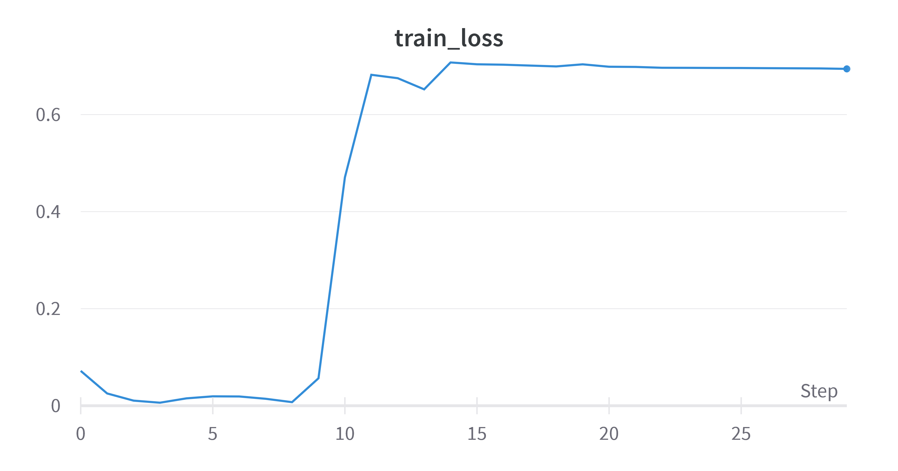
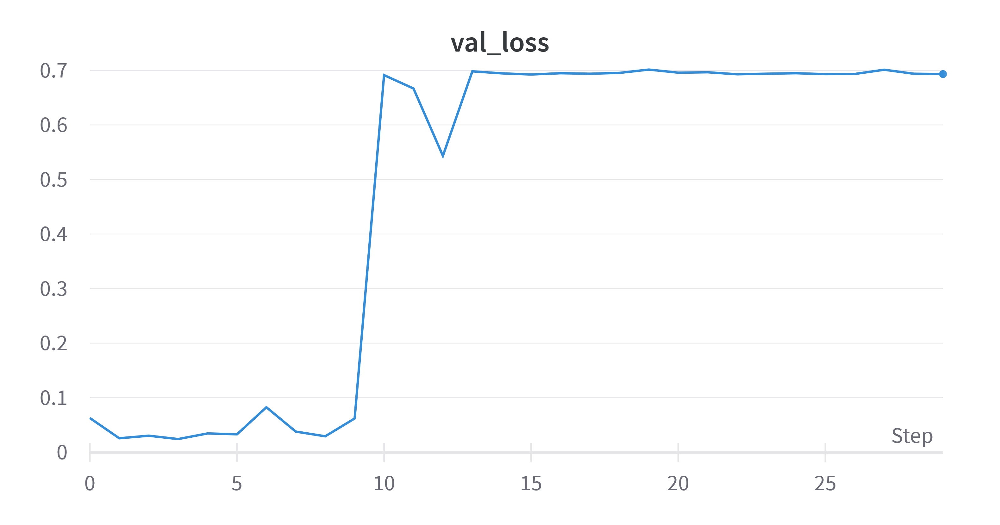
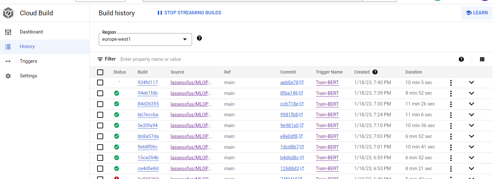

# Exam template for 02476 Machine Learning Operations

This is the report template for the exam. Please only remove the text formatted as with three dashes in front and behind
like:

```--- question 1 fill here ---```

where you instead should add your answers. Any other changes may have unwanted consequences when your report is auto
generated in the end of the course. For questions where you are asked to include images, start by adding the image to
the `figures` subfolder (please only use `.png`, `.jpg` or `.jpeg`) and then add the following code in your answer:

```markdown

```

In addition to this markdown file, we also provide the `report.py` script that provides two utility functions:

Running:

```bash
python report.py html
```

will generate an `.html` page of your report. After deadline for answering this template, we will autoscrape
everything in this `reports` folder and then use this utility to generate an `.html` page that will be your serve
as your final handin.

Running

```bash
python report.py check
```

will check your answers in this template against the constrains listed for each question e.g. is your answer too
short, too long, have you included an image when asked to.

For both functions to work it is important that you do not rename anything. The script have two dependencies that can
be installed with `pip install click markdown`.

## Overall project checklist

The checklist is *exhaustic* which means that it includes everything that you could possible do on the project in
relation the curricilum in this course. Therefore, we do not expect at all that you have checked of all boxes at the
end of the project.

### Week 1

* [ ] Create a git repository
* [ ] Make sure that all team members have write access to the github repository
* [ ] Create a dedicated environment for you project to keep track of your packages
* [ ] Create the initial file structure using cookiecutter
* [ ] Fill out the `make_dataset.py` file such that it downloads whatever data you need and
* [ ] Add a model file and a training script and get that running
* [ ] Remember to fill out the `requirements.txt` file with whatever dependencies that you are using
* [ ] Remember to comply with good coding practices (`pep8`) while doing the project
* [ ] Do a bit of code typing and remember to document essential parts of your code
* [ ] Setup version control for your data or part of your data
* [ ] Construct one or multiple docker files for your code
* [ ] Build the docker files locally and make sure they work as intended
* [ ] Write one or multiple configurations files for your experiments
* [ ] Used Hydra to load the configurations and manage your hyperparameters
* [ ] When you have something that works somewhat, remember at some point to to some profiling and see if
      you can optimize your code
* [ ] Use Weights & Biases to log training progress and other important metrics/artifacts in your code. Additionally,
      consider running a hyperparameter optimization sweep.
* [ ] Use Pytorch-lightning (if applicable) to reduce the amount of boilerplate in your code

### Week 2

* [ ] Write unit tests related to the data part of your code
* [ ] Write unit tests related to model construction and or model training
* [ ] Calculate the coverage.
* [ ] Get some continuous integration running on the github repository
* [ ] Create a data storage in GCP Bucket for you data and preferable link this with your data version control setup
* [ ] Create a trigger workflow for automatically building your docker images
* [ ] Get your model training in GCP using either the Engine or Vertex AI
* [ ] Create a FastAPI application that can do inference using your model
* [ ] If applicable, consider deploying the model locally using torchserve
* [ ] Deploy your model in GCP using either Functions or Run as the backend

### Week 3

* [ ] Check how robust your model is towards data drifting
* [ ] Setup monitoring for the system telemetry of your deployed model
* [ ] Setup monitoring for the performance of your deployed model
* [ ] If applicable, play around with distributed data loading
* [ ] If applicable, play around with distributed model training
* [ ] Play around with quantization, compilation and pruning for you trained models to increase inference speed

### Additional

* [ ] Revisit your initial project description. Did the project turn out as you wanted?
* [ ] Make sure all group members have a understanding about all parts of the project
* [ ] Uploaded all your code to github

## Group information

### Question 1
> **Enter the group number you signed up on <learn.inside.dtu.dk>**
>
> Answer:

35

### Question 2
> **Enter the study number for each member in the group**
>
> Example:
>
> *sXXXXXX, sXXXXXX, sXXXXXX*
>
> Answer:

s185927, s194278, s194252, s221932, s212592

### Question 3
> **What framework did you choose to work with and did it help you complete the project?**
>
> Answer length: 100-200 words.
>
> Example:
> *We used the third-party framework ... in our project. We used functionality ... and functionality ... from the*
> *package to do ... and ... in our project*.
>
> Answer:

We used the Huggingface Transformer framework to load a pretrained BERT model architecture to solve the news article reliability prediction problem at hand. This allowed for a quick start with inferring the realiability of news articles with only minimal training. Besides from the model architecture, we also used the ready-made tokenization functionality to processes the used text datasets, which made loading and necessary pre-processing very easy to perform. Overall the framework has proven to be very helpful in pursuing the goal of the project, however the final model performance indicate that further model optimization/training should be conducted to really make things functional. 

## Coding environment

> In the following section we are interested in learning more about you local development environment.

### Question 4

> **Explain how you managed dependencies in your project? Explain the process a new team member would have to go**
> **through to get an exact copy of your environment.**
>
> Answer length: 100-200 words
>
> Example:
> *We used ... for managing our dependencies. The list of dependencies was auto-generated using ... . To get a*
> *complete copy of our development enviroment, one would have to run the following commands*
>
> Answer:

We used a `requirements.txt` file for managing our dependencies. The list of dependencies was auto-generated using `pip freeze` (or alternatively the 'pipreqs' package). To get a complete copy of our development environment, one would have to do the following:

1. Create and activate new virtual environment (using `conda create -n <env_name>` followed by `conda activate <env_name>`)
2. Git clone repository: `git clone git@github.com:lassesofus/MLOPS-Exam-Project.git`
3. Navigate to the root directory of the repository
4. Run `pip install -r requirements.txt` to install dependencies and the repository as a python module 

By using a `requirements.txt` file, we can easily manage the dependencies for our project and make sure that the environment is consistent across different (virtual) machines and development stages. It is also useful for sharing the dependencies with other members of the team and for deploying the application to production. 

### Question 5

> **We expect that you initialized your project using the cookiecutter template. Explain the overall structure of your**
> **code. Did you fill out every folder or only a subset?**
>
> Answer length: 100-200 words
>
> Example:
> *From the cookiecutter template we have filled out the ... , ... and ... folder. We have removed the ... folder*
> *because we did not use any ... in our project. We have added an ... folder that contains ... for running our*
> *experiments.*
> Answer:

We used the majority of the original cookiecutter folder structure including the `src`, `models`, and `data` folders amongst others. The `data/interim`, `references` and `src/features` (we don't do any feature engineering). The `.dvc` folder is automatically added by the dvc package for version control of the data and model weights. The `api` folder is added to contain the code, requirements and dockerfile for the API.  The `docker` folder is added to contain the dockerfiles for local training and prediction. The `hydra_config` folder is added to contain the configuration files for training and prediction. The hydra package automatically creates a `outputs` folder that saves logs of the config files used when the package is invoked (these are gitignored). Similarly the `wandb` folder is automatically added to the local repository to contain the weights and biases logs (but this is also gitignored). The `tests` folder is added to contain the unit tests run by Github actions.

### Question 6

> **Did you implement any rules for code quality and format? Additionally, explain with your own words why these**
> **concepts matters in larger projects.**
>
> Answer length: 50-100 words.
>
> Answer:

Yes, we used pre-commit hooks for checking file size, sorting import statements and checking if the code is pep8 compliant throughout points of the project. We also used Github actions (workflow files) to do the exact same at each push/pull request as well as run a bunch of unit tests. In the end of the project we also introduced branch protection rules to ensure that all tests had to pass before merging to the main branch. 

## Version control

> In the following section we are interested in how version control was used in your project during development to
> corporate and increase the quality of your code.

### Question 7

> **How many tests did you implement and what are they testing in your code?**
>
> Answer length: 50-100 words.
>
> Example:
> *In total we have implemented X tests. Primarily we are testing ... and ... as these the most critical parts of our*
> *application but also ... .*
>
> Answer:

We ended up having 11 unit tests.

### Question 8

> **What is the total code coverage (in percentage) of your code? If you code had an code coverage of 100% (or close**
> **to), would you still trust it to be error free? Explain you reasoning.**
>
> Answer length: 100-200 words.
>
> Example:
> *The total code coverage of code is X%, which includes all our source code. We are far from 100% coverage of our **
> *code and even if we were then...*
>
> Answer:

We obtained a total code coverage of 91%, which includes the majority of our source code. While having a high code coverage is generally a good indication that our code has been thoroughly tested, it does not guarantee that our code is error-free. For example, a high code coverage percentage can be misleading if the tests only cover a small set of inputs. Additionally, even if a line of code has been executed, it does not mean that it has been executed correctly. Furthermore, even if our code coverage was 100%, we would still not completely trust that our code is error-free. There are many other factors that can contribute to bugs and errors, such as edge cases, rare conditions, security vulnerabilities, and more. Therefore, it is important to use a combination of code coverage, manual testing, and other quality assurance techniques to ensure that our code is as robust and reliable as possible.

### Question 9

> **Did you workflow include using branches and pull requests? If yes, explain how. If not, explain how branches and**
> **pull request can help improve version control.**
>
> Answer length: 100-200 words.
>
> Example:
> *We made use of both branches and PRs in our project. In our group, each member had an branch that they worked on in*
> *addition to the main branch. To merge code we ...*
>
> Answer:

In our workflow, we made use of the git feature of branches and pull requests to maintain the organization and integrity of our codebase. By creating separate branches for different functionalities or bug fixes, it allowed for a more streamlined and independent development process. This meant that we could work on our own code without any interference to the main branch. After completing the work on our respective branches, we would then submit pull requests to merge our changes into the main branch. This was an important step as it allowed for code review and collaboration among the team members. Additionally, it enabled us to catch and resolve any potential issues before they were integrated into the main codebase. Furthermore, the usage of branches and pull requests also improved version control as we were able to see the changes made in each pull request and also have the option to revert to a previous version if needed. This was particularly useful when we needed to make modifications to a feature that we had already finished working on.

### Question 10

> **Did you use DVC for managing data in your project? If yes, then how did it improve your project to have version**
> **control of your data. If no, explain a case where it would be beneficial to have version control of your data.**
>
> Answer length: 100-200 words.
>
> Example:
> *We did make use of DVC in the following way: ... . In the end it helped us in ... for controlling ... part of our*
> *pipeline*
>
> Answer:

In our project, we employed the use of DVC (Data Version Control) to manage and track the versions of our data and model weights. Additionally, DVC also provided the benefit of allowing team members to easily access and download the dataset, as well as share the model weights with one another, without the need to rely on Github. This was particularly useful as Github has a file size limit, and storing large data files or model weights directly on Github can be challenging. DVC provided an effective way for us to store, manage and share our data and model weights, which greatly improved the efficiency and collaboration within our team.

### Question 11

> **Discuss you continues integration setup. What kind of CI are you running (unittesting, linting, etc.)? Do you test**
> **multiple operating systems, python version etc. Do you make use of caching? Feel free to insert a link to one of**
> **your github actions workflow.**
>
> Answer length: 200-300 words.
>
> Example:
> *We have organized our CI into 3 separate files: one for doing ..., one for running ... testing and one for running*
> *... . In particular for our ..., we used ... .An example of a triggered workflow can be seen here: <weblink>*
>
> Answer:

We implemented a partial Continuous Integration (CI) system using Github action workflow files located in the `.github` directory. These files were responsible for running a variety of tests, such as isort (fixing the order of import statements), flake8 (for ensuring pep8 compliance) and unit tests, on our codebase. To optimize the efficiency of the CI process, we utilized caching on the workflow virtual machines (VMs), which allowed us to avoid the need to download requirements each time the workflow was run. The workflow files were triggered on every push and pull request to the main branch, and the tests were run on multiple operating systems, including MacOS, Ubuntu, and Windows. Additionally, we also utilized pre-commit in our CI process, which was configured to run a file-size-check, isort and flake8. Furthermore, we also used a Google Cloud trigger to build a new Docker training image that could be used for Vertex AI training each time we pushed or pulled request to the main branch. An example of the unit test workflow can be found here: <weblink>https://github.com/lassesofus/MLOPS-Exam-Project/blob/main/.github/workflows/tests_with_cache.yml</weblink>. This workflow is an example of the various tests and configurations that we employed in our CI process to ensure the reliability and quality of our codebase.


## Running code and tracking experiments

> In the following section we are interested in learning more about the experimental setup for running your code and
> especially the reproducibility of your experiments.

### Question 12

> **How did you configure experiments? Did you make use of config files? Explain with coding examples of how you would**
> **run a experiment.**
>
> Answer length: 50-100 words.
>
> Example:
> *We used a simple argparser, that worked in the following way: python my_script.py --lr 1e-3 --batch_size 25*
>
> Answer:

We used the Hydra library to configure our experiments. This allowed us to easily manage and structure our hyperparameters outside python scripts. We created a hierarchy of config files (training, prediction and model parameters), which specified the different values for each hyperparameter, such as the learning rate and batch size. To run an experiment we would simply use the command: `python src/models/train_model.py.` This would then use the hyperparameter values specified in the config.yaml file given in the `train_mode.py` script via Hydra as
  ```
  @hydra.main(version_base=None, 
            config_name="config.yaml", 
            config_path="../../hydra_config")
  ```


### Question 13

> **Reproducibility of experiments are important. Related to the last question, how did you secure that no information**
> **is lost when running experiments and that your experiments are reproducible?**
>
> Answer length: 100-200 words.
>
> Example:
> *We made use of config files. Whenever an experiment is run the following happens: ... . To reproduce an experiment*
> *one would have to do ...*
>
> Answer:

Reproducibility is crucial in scientific research, and we made sure to take steps to ensure that our experiments were reproducible. One of the ways we did this was by using version control software such as Git to track changes to our codebase and config files. This allowed us to easily roll back to previous versions of our code if needed, and also enabled us to collaborate on the project with other team members. We also made sure to document our experimental setup, including the specific versions of any libraries or frameworks used. Additionally, we made use of data versioning techniques, such as saving the processed data, so that we can easily access the same data set if needed. We also made use of logging and monitoring tools to keep track of the experiment parameters, metrics (e.g. training loss, validation accuracy and config files), and other information, which would be useful for reproducing the results. Eventually, to reproduce an experiment you would have access to the utilized data, model configurations, hyperparameters and ideally also system-level information.

### Question 14

> **Upload 1 to 3 screenshots that show the experiments that you have done in W&B (or another experiment tracking**
> **service of your choice). This may include loss graphs, logged images, hyperparameter sweeps etc. You can take**
> **inspiration from [this figure](figures/wandb.png). Explain what metrics you are tracking and why they are**
> **important.**
>
> Answer length: 200-300 words + 1 to 3 screenshots.
>
> Example:
> *As seen in the first image when have tracked ... and ... which both inform us about ... in our experiments.*
> *As seen in the second image we are also tracking ... and ...*
>
> Answer:

In the first image below, we see a plot of the binary cross-entropy loss of training the BERT model for the 30 epochs. This run corresponds to the hyperparameters specified in the configuration files. The initially declining curve testifies of the model's ability to learn characteristics of the training dataset, which, however, seems to increase again drastically and finally plateau during the later epochs on a high level. This means that our model doesn't seem to learn from our data. As this part was not the focus of the course, we decided to still continue with this weak model. The second image shows the validation loss. We can see here again that the loss is increasing over the epochs. This is the contrary of how it should look like and confirms again the assumption that our model doesn’t the features of our dataset. We decided to use the accuracy as the test metric for the performance of our model. Hence, it was important to log that too. As the plot of one number doesn’t provide any benefit, we just want to state here that the achieved accuracy was 63.85%. This is not a great result, but at least the performance is better than randomly guessing.
 



### Question 15

> **Docker is an important tool for creating containerized applications. Explain how you used docker in your**
> **experiments? Include how you would run your docker images and include a link to one of your docker files.**
>
> Answer length: 100-200 words.
>
> Example:
> *For our project we developed several images: one for training, inference and deployment. For example to run the*
> *training docker image: `docker run trainer:latest lr=1e-3 batch_size=64`. Link to docker file: <weblink>*
>
> Answer:

We used Docker in our experiments to create containerized applications for training our model and performing inference. We created Docker images for our model and its dependencies, which allowed us to easily reproduce the environment in which the model was trained. Docker was also used to create containers for running our model during inference. This allowed us to easily deploy our model to different environments without having to worry about compatibility issues. Additionally, using Docker made it easy to scale our inference infrastructure by running multiple instances of our model in parallel, if needed. 

To some extent we used the concept of Docker Volumes to mount our dataset and store the output of our model. This allowed us to keep our data separate from the container and make changes to it without having to rebuild the image. Docker images was also used extensively in our cloud training (using training image for Vertex AI) and our cloud deployment (using FastAPI image with Cloud Run).

For example, to run the training image, we would input the below command in the terminal:
`docker run --name exp3 --env WANDB_API_KEY=<insert> --env WANDB_ENTITY=<insert> --env WANDB_PROJECT=<insert> trainer_cpu:latest`

For running GPU image include the command `--env PROTOCOL_BUFFERS_PYTHON_IMPLEMENTATION=python.`


[Link to inference/prediction Docker file](https://github.com/lassesofus/MLOPS-Exam-Project/blob/main/predict.dockerfile)

### Question 16

> **When running into bugs while trying to run your experiments, how did you perform debugging? Additionally, did you**
> **try to profile your code or do you think it is already perfect?**
>
> Answer length: 100-200 words.
>
> Example:
> *Debugging method was dependent on group member. Some just used ... and others used ... . We did a single profiling*
> *run of our main code at some point that showed ...*
>
> Answer:

When we encountered bugs while running our experiments, our primary method of debugging was using the built-in debugger in VS Code. This allowed us to set breakpoints in our code and step through the execution line by line to identify the source of the issue. Additionally, we also used more simple print statements to check the values of variables at various stages of the code to further narrow down the problem.

In addition to debugging, we also performed a single profiling run to investigate our code for any possible areas of improvement. Profiling allowed us to identify any bottlenecks or inefficiencies in our code, such as computationally expensive operations or excessive use of memory. 

Overall, we believe that our code is functional and efficient, but there is always room for improvement.

## Working in the cloud

> In the following section we would like to know more about your experience when developing in the cloud.

### Question 17

> **List all the GCP services that you made use of in your project and shortly explain what each service does?**
>
> Answer length: 50-200 words.
>
> Example:
> *We used the following two services: Engine and Bucket. Engine is used for... and Bucket is used for...*
>
> Answer:

We made use of several Google Cloud Platform (GCP) services in our project, including Cloud Storage, Cloud Build, Vertex AI, and Compute Engine.

Cloud Storage is a service that allows us to store and access data in the cloud. We used Cloud Storage to store all our files, datasets and model weights, which were used as input data for our models.

Cloud Build is a service that allows us to build and test our code in the cloud. We used Cloud Build to automatically build and deploy our code, which helped us to automate the development pipeline and improve the collaboration within our team.

Vertex AI is a service that allows us to perform machine learning operations on the cloud. We used Vertex AI to train and deploy our machine learning models, which helped us to leverage the scalability and reliability of GCP to ensure that our models were able to run smoothly and efficiently.

That's the gcloud  command to create custom jobs through CI.

	gcloud ai custom-jobs create \
   	--region=europe-west1 \
   	--display-name=test-run \
   	--config=config_gpu.yaml

We also tried using the Compute Engine directly for model training. 

### Question 18

> **The backbone of GCP is the Compute engine. Explained how you made use of this service and what type of VMs**
> **you used?**
>
> Answer length: 100-200 words.
>
> Example:
> *We used the compute engine to run our ... . We used instances with the following hardware: ... and we started the*
> *using a custom container: ...*
>
> Answer:

In our experimentation with initial training of our model, we utilized GCP's Compute Engine as our primary platform. To do this, we created compute instances, also known as virtual machines (VM's), of the n1-standard-1 type. These instances were equipped with a single NVIDIA V100 GPU, which provided us with powerful computation capabilities.

We used these instances to run one of our customer training Docker images, which contained all of the necessary dependencies for our model. However, we also made use of DTU HPC as a secondary platform for prototyping on another machine with enough VRAM.

### Question 19

> **Insert 1-2 images of your GCP bucket, such that we can see what data you have stored in it.**
> **You can take inspiration from [this figure](figures/bucket.png).**
>
> Answer:


### Question 20

> **Upload one image of your GCP container registry, such that we can see the different images that you have stored.**
> **You can take inspiration from [this figure](figures/registry.png).**
>
> Answer:


### Question 21

> **Upload one image of your GCP cloud build history, so we can see the history of the images that have been build in**
> **your project. You can take inspiration from [this figure](figures/build.png).**
>
> Answer:



### Question 22

> **Did you manage to deploy your model, either in locally or cloud? If not, describe why. If yes, describe how and**
> **preferably how you invoke your deployed service?**
>
> Answer length: 100-200 words.
>
> Example:
> *For deployment we wrapped our model into application using ... . We first tried locally serving the model, which*
> *worked. Afterwards we deployed it in the cloud, using ... . To invoke the service an user would call*
> *`curl -X POST -F "file=@file.json"<weburl>`*
>
> Answer:

For deploymeny we wrapped our model into an application using an API built using FastAPI. The model was deployed in the cloud using Google Cloud Run. The API is designed to take a txt-file as input and returns a response dictionary, which includes the input text, a prediction of whether the text is reliable or unreliable, the HTTP status message and the HTTP status code. The prediction is made using a model with weights loaded from a Google Cloud bucket, which allows for quick and easy access to the model's pre-trained weights. To invoke the service an user would call `curl -X POST -H "accept: application/json"  -H "Content-Type: multipart/form-data" -H "Content-Type: text/plain" -F "data=@example.txt" https://test-app-tuy6dmah2a-ew.a.run.app/'
This command sends a POST request to the specified URL, and includes the necessary headers and input file in the request. This allows the API to process the input file and return the desired response dictionary.


### Question 23

> **Did you manage to implement monitoring of your deployed model? If yes, explain how it works. If not, explain how**
> **monitoring would help the longevity of your application.**
>
> Answer length: 100-200 words.
>
> Example:
> *We did not manage to implement monitoring. We would like to have monitoring implemented such that over time we could*
> *measure ... and ... that would inform us about this ... behaviour of our application.*
>
> Answer:

We did not manage to implement monitoring of our deployed model. Monitoring would have allowed us to track the performance of our model over time, identify any issues or errors, and make adjustments as needed to improve its performance. Additionally, monitoring can provide valuable insights into how our model is being used, such as identifying patterns in user behavior or usage patterns. This can help us to understand how to optimize our model for specific use cases or user groups. Furthermore, monitoring can help us to detect data drift, which occurs when the distribution of data used to train the model differs from the distribution of data encountered during deployment. This can cause the model to make predictions that are less accurate. By monitoring the model's performance over time, we can detect when data drift is occurring and retrain the model on new data to correct it. A framework like Evidently could give use insights with metrics and reports. 

At last, a framework like opentelemetry can help to monitor the number of requests and the amount of time our application runs per request. Combined with Alerting on Google Cloud, we can be aware if any metric/telemetry is not behaving properly.

### Question 24

> **How many credits did you end up using during the project and what service was most expensive?**
>
> Answer length: 25-100 words.
>
> Example:
> *Group member 1 used ..., Group member 2 used ..., in total ... credits was spend during development. The service*
> *costing the most was ... due to ...*
>
> Answer:

Evan, s212592: $50. Most spended on running the VMs.
  
Julia, s221932: $50 (accidentally spend on the first day of using the cloud by virtual machines)
  
Louis, s194278: $30.49 
  
Alexander, s194252: $15.22
  
Lasse, s185927: $12.65

## Overall discussion of project

> In the following section we would like you to think about the general structure of your project.

### Question 25

> **Include a figure that describes the overall architecture of your system and what services that you make use of.**
> **You can take inspiration from [this figure](figures/overview.png). Additionally in your own words, explain the**
> **overall steps in figure.**
>
> Answer length: 200-400 words
>
> Example:
>
> *The starting point of the diagram is our local setup, where we integrated ... and ... and ... into our code.*
> *Whenever we commit code and puch to github, it auto triggers ... and ... . From there the diagram shows ...*
>
> Answer:


This figure is split into three parts. The right parts contains the local part, the left part the GCP part and at the top we have included the DTU HPC. We started with the local setup on the right side. The main two frameworks we used were pytorch and transformers of hugging face. We used a conda environment for the package organisation. We integrated hydra configuration files and connected the code to wandb to log the progress of the experiments. We organised all files in a cookiecutter template. Whenever we commit code and push to github, it auto triggers the execution of the written unittests and checks for pep8/flake8 format. Initially we stored our data in google drive and pulled/pushed via DVC. We trained different models on the HPC. Furthermore, we created locally docker images for the training, the model and the prediction script. We then started to use the Google cloud. First, we moved our data to a bucket in GCP and enabled pull/push via DVC. Additionally, we achieved that the docker images are automatically updated after every push on github. These images are then used for training with VertexAI. We also stored the model weights in a bucket in the cloud.
As a final step, we added an API to make it easy for an user to get a prediction for a given text input.

### Question 26

> **Discuss the overall struggles of the project. Where did you spend most time and what did you do to overcome these**
> **challenges?**
>
> Answer length: 200-400 words.
>
> Example:
> *The biggest challenges in the project was using ... tool to do ... . The reason for this was ...*
>
> Answer:

We faced several technical challenges throughout the project. One of the biggest struggles we encountered was with dependency issues when installing new packages. This often resulted in delays as we had to research and troubleshoot the issues. Another challenge we faced was with the time it took to build Docker images. This was particularly frustrating as it added to the overall time required to complete our experiments.

Another major struggle we encountered was coordination within the team. Ensuring that everyone knew what tasks they were responsible for and keeping track of progress was a time-consuming process. Additionally, maintaining a functioning Github repository was a constant challenge as we had to ensure that everyone was committing and merging code correctly to avoid conflicts.

Finally, working with GCP was quite heavy, as we struggled with the complexity of the platform and the steep learning curve. This added to our workload and made it difficult for us to complete our tasks in a timely manner.

To overcome these challenges, we implemented a more structured approach to our project management and set up regular meetings to discuss progress and address any issues that arose. We also made a conscious effort to keep our Github repository organized and to document our work as we went along. Additionally, we spent more time researching and experimenting with different techniques to speed up the building of Docker images and resolving dependency issues. Finally, we spent more time learning GCP and figuring out how to use it effectively, which made it easier for us to work with it. Figuring out how to set up jobs and interactive training in HPC DTU also added quite a bit of time to the project for the uninitialized group members.

### Question 27

> **State the individual contributions of each team member. This is required information from DTU, because we need to**
> **make sure all members contributed actively to the project**
>
> Answer length: 50-200 words.
>
> Example:
> *Student sXXXXXX was in charge of developing of setting up the initial cookie cutter project and developing of the*
> *docker containers for training our applications.*
> *Student sXXXXXX was in charge of training our models in the cloud and deploying them afterwards.*
> *All members contributed to code by...*
>
> Answer:

Every group member participated in all aspects of the project. Below, the main focus of each member is stated.
  
Julia, s221932, set up hydra configuration, implemented unittests for data, model and train, calculated coverage, looked into compilation, created figures for the report
  
Louis, s194278, writing python scripts (make_dataset, data_utils, model, predict_model, train_model), set up Github actions (auto lint and framework for unit tests), create cpu docker files for local training/prediction, pre-commit, wandb, trigger workflow, fastAPI and Cloud Run deployment. 
  
Alexander, s194252, Did model training on the HPC. Built and tested local docker images for training and inference. Helped debugging and reviewing the training script, inference script and unit tests. 
  
Lasse, s185927, set up Github repository (with cookiecutter structure) and data storage (including DVC). Did initial training model training runs on the HPC. Build Docker images. Reviewed inference script. Responsible for the majority of the report. 
  
Evan, s212592, helped with creating the train_model, train_cloud and predict_model scripts. Set up the first unit test, the github workflow and actions on github. Build and test docker images. Mainly focused on setting the project on google cloud, give access to everyone, create buckets, VMs, the container registry, the Trigger and the Vertex AI.
